# Second day of workshop

- Discussion with Camille

## Brainstorming

- Brainstorming about our project's scenario
- Thinking about why the sea slugs should go on earth
- How to create tension with bird remains (are they really dead ???)
- The maquette will be an island surrounded by water
- We wrote a first pitch
- Thinking about using some elements collected in nature (moss, ...)

# Craft

- Léonie made 2 sea angels out of paper and started one Sheep Sea Slug
- Flore started a bird's skeleton in paper to see if it could be an option for our maquette
- Ordered feathers from internet

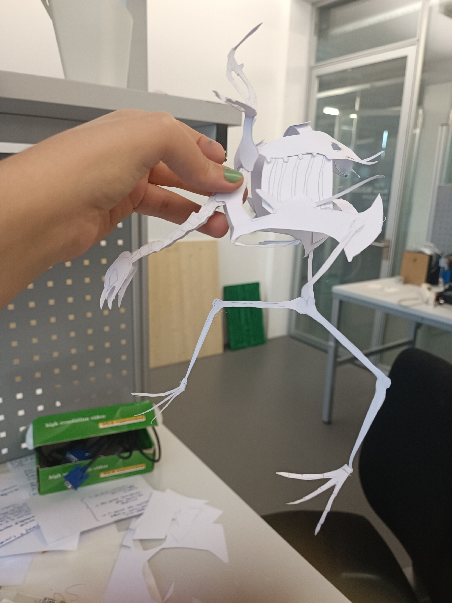
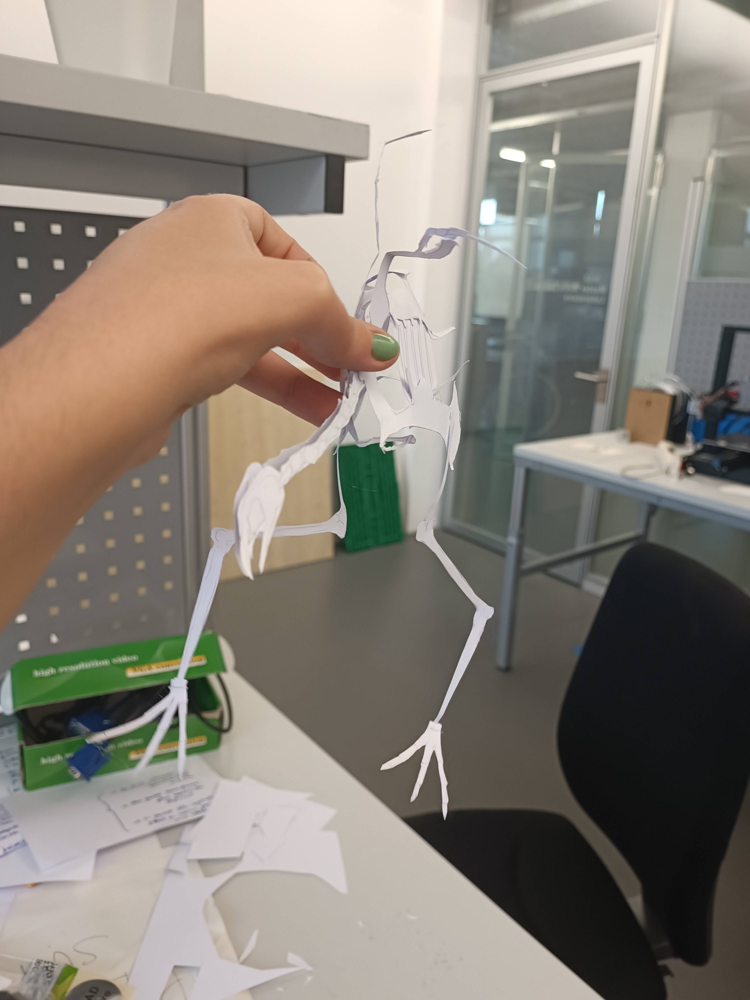
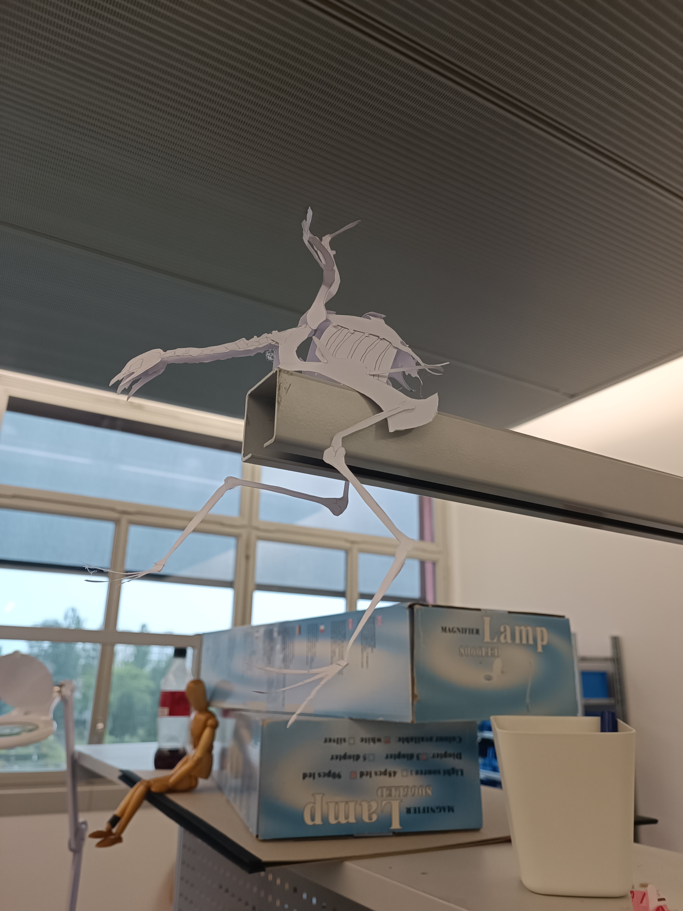
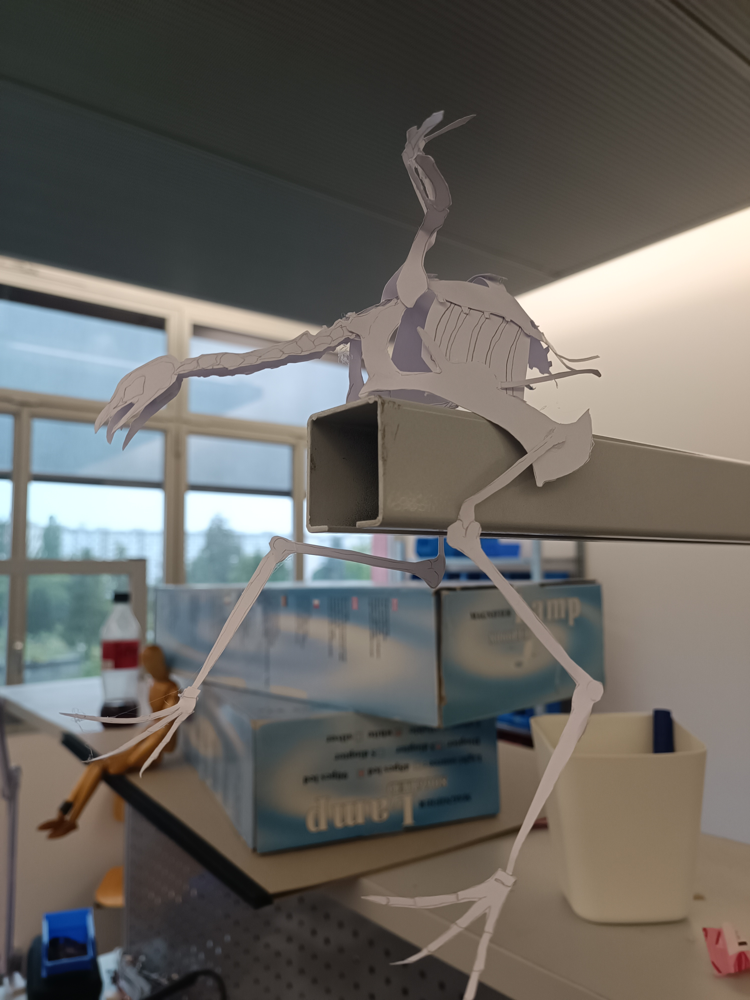
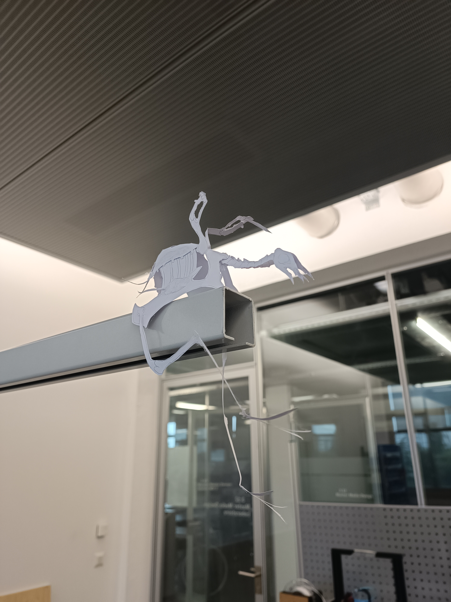
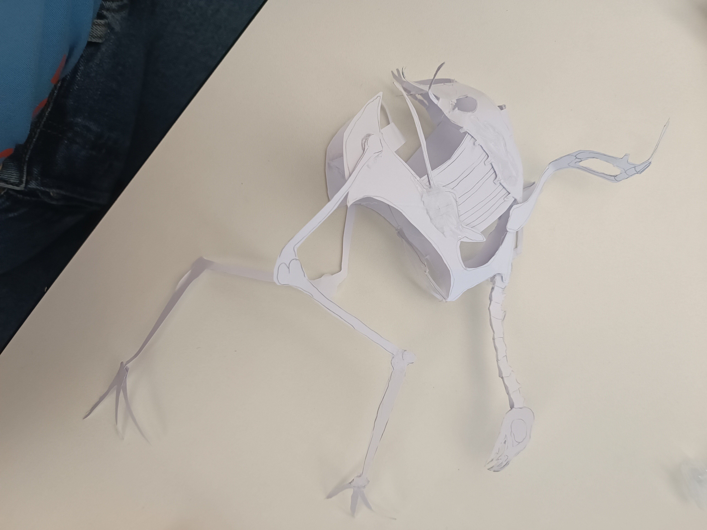
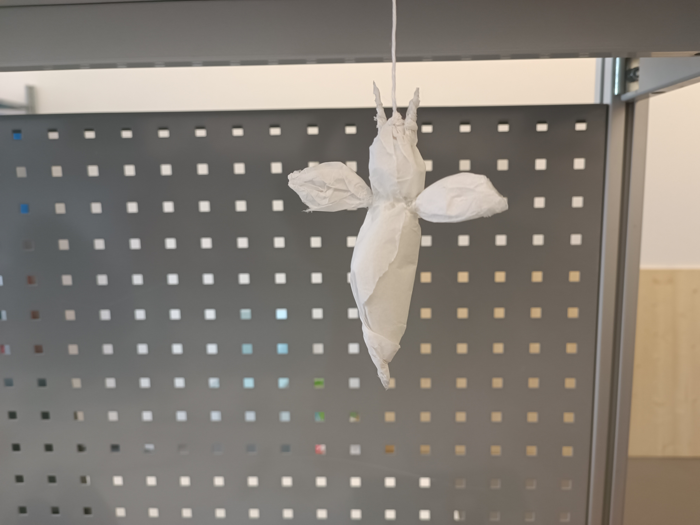
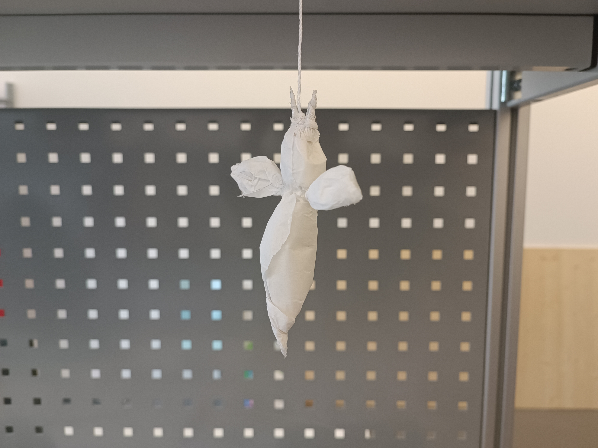
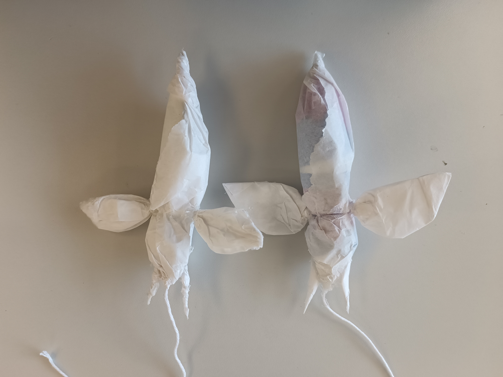
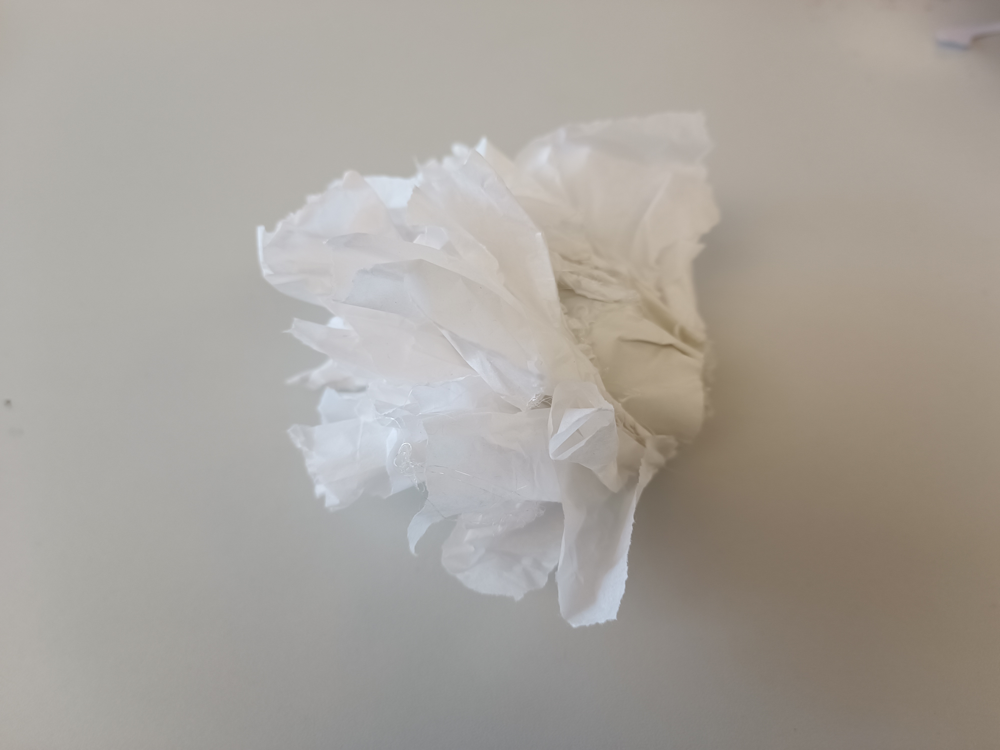
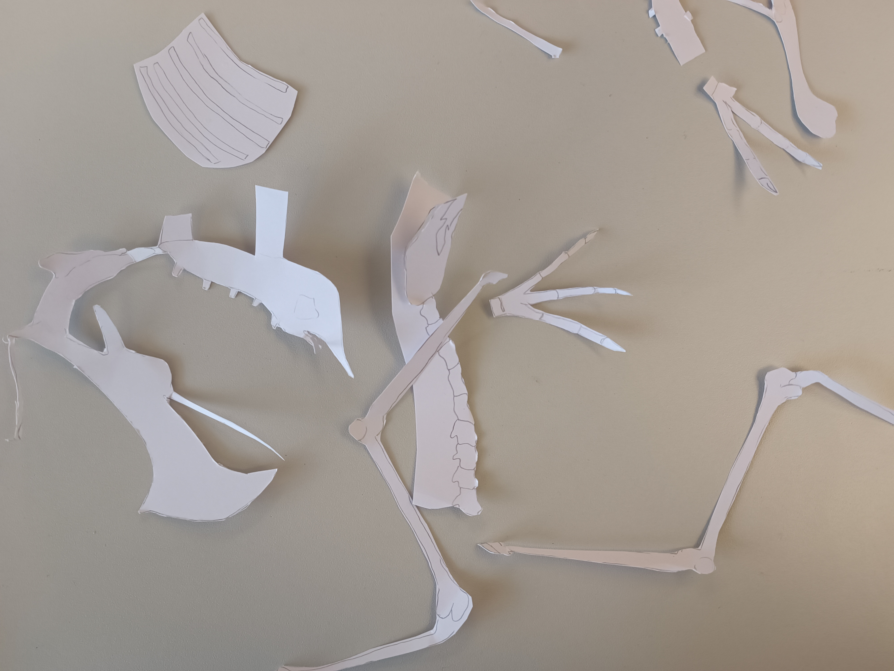
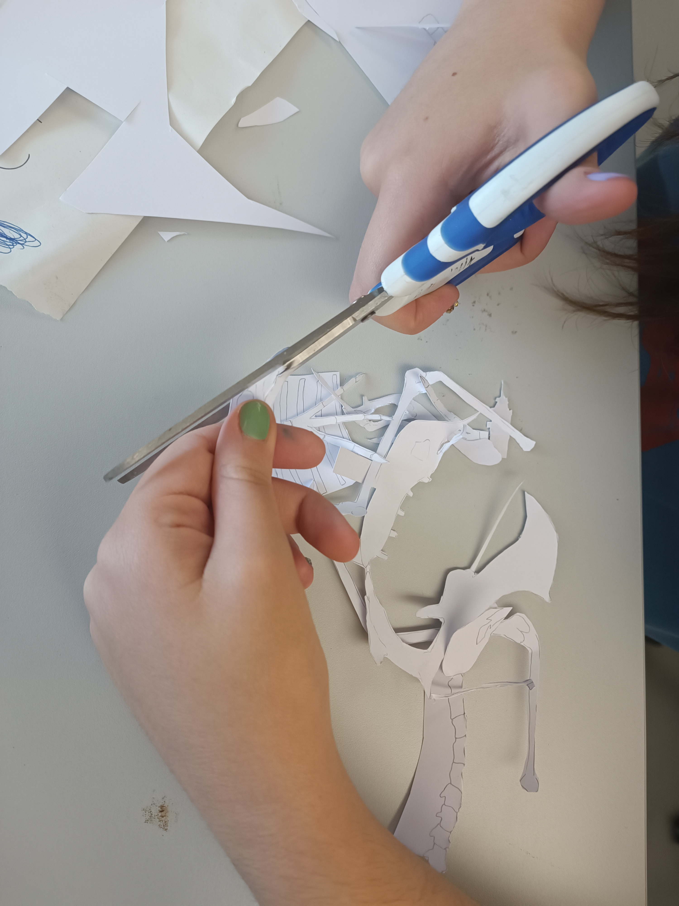