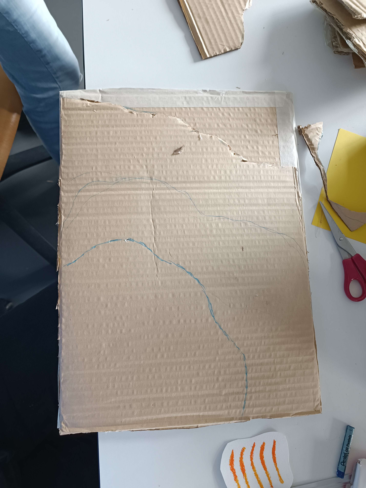

# Fourth day of workshop

## Craft

- We made a cardboard base for our maquette
- We built two new bird skulls and a beginning of a skeleton, we used pastels to create texture
- We made and algae out of felted wool
- We scanned a part of the paper skeleton, the algae and two skulls with PolyCam and PhotoScan

## Brief with the teachers

- We should simplify how the character moves in the scene (teleportation points ?)
- We should have a nice maquette in addition to the unity project (maybe have replica of some bigger elements to fit our base and give and idea of the scale)
- Make a photoshop document with picture to also give an idea of the scale
- Think of the feather's role in the story

