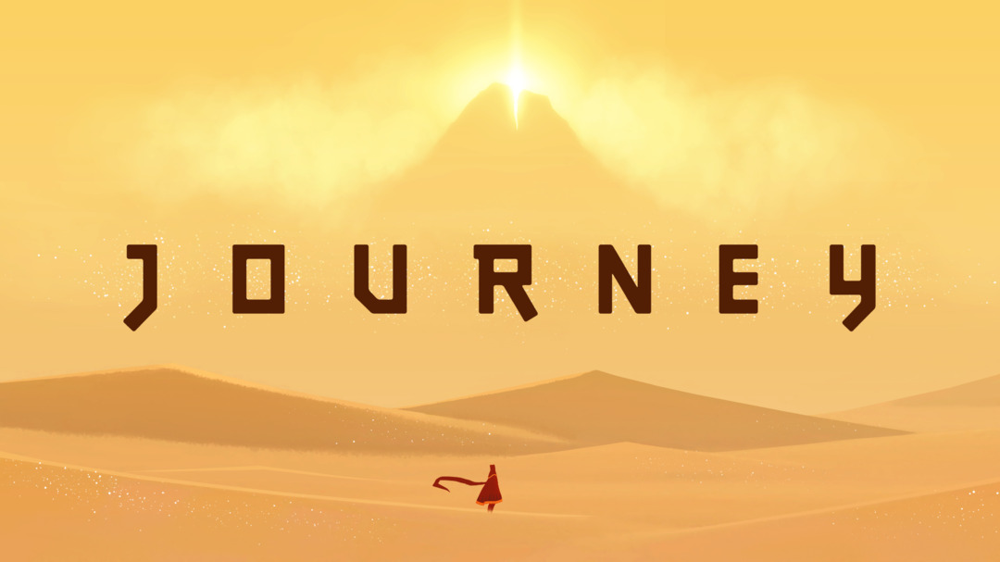
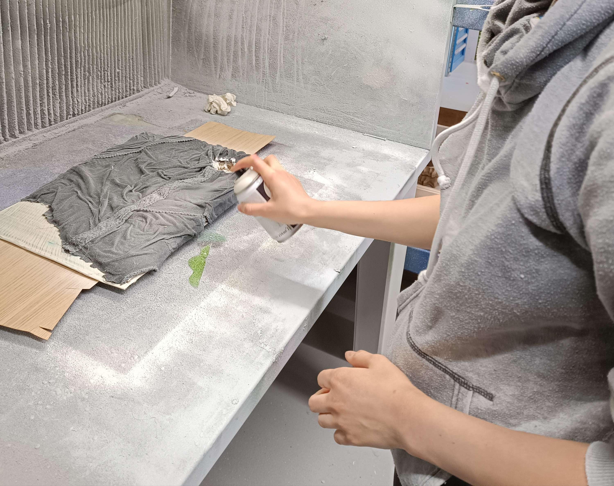

# Fifth day of workshop

## Craft

- We glued some textile to our maquette to create the shape of the ground
- We added some leftover spray paint to make it easier to apply acrylic the next day

## Brief with the teachers

- Camille asked us to precise more the story and maybe rework the texture of the cliones
- Flore suggested the main quest of the story is the clione have to go on the ground in order to give birth in a pound (Like animals that need to take risks to give birth as salmons or turtles)
- Sabrina helped us with the story from here. She suggested we evolve on the land as a group of clione with some of them dying along the way.
- Algaes are no longer teleportation points. They are just part of the background and can help us to see if we are getting closer to the pound.
- We think a long automatic travelling will be more appropriate for the current story (instead of teleportation points and static camera)
- Sabrina suggested we could switch from the point of view of a clione to another. The reason behind the switching of point of view thing could be clione giving to the other the "Breath of life" they need to bring to the pound. We can have different types of clione.
- Clione could go in different directions. Maybe, we can reunite them with a sign.
- Flore suggested that our cliones can "sing", when they do that, the others cliones respond in chorus (inspiration from Journey). At the beginning when they are a lot, we obtain a lot of singing answers. At the end, we only have a few. So it gives a hint about the deaths of the group.

## Others

- We started looking for sign language. We could use some words as inputs for the interactions.
- We played to Journey (2012) since it might be quite a big reference for our project

