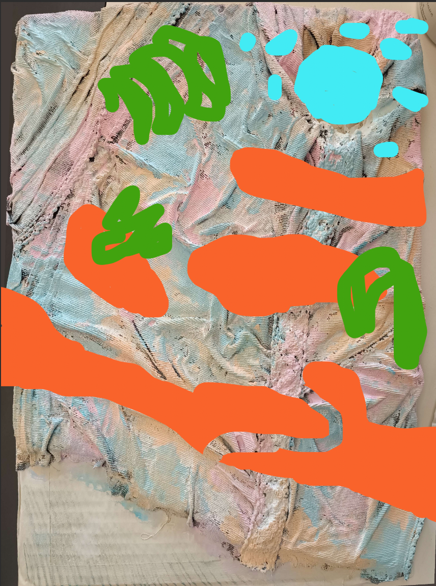

# Sixth day of workshop

## Craft

- We painted the maquette's base with white acrylic and pastel colors
- Me made 3D scans of our main bird skeleton
- We added the water made out of blue leather (and pastels for the pounds)
- We made new sea angels out of felted wool
- We made a map to have an overal idea of where we put the different items
- We started building the walls/cliffs in cardboard

## Brief with the teachers

- Camille showed us how to scan 3D objects with Photocam
- Camille and Douglas asked us about potential real life simulation on our maquette (floating feathers)
- We talked about the aesthetic of our project with Sabrina (what does it mean, what is scary or not, maybe some new ideas, ...)
- We talked topology of our maquette with Douglas

