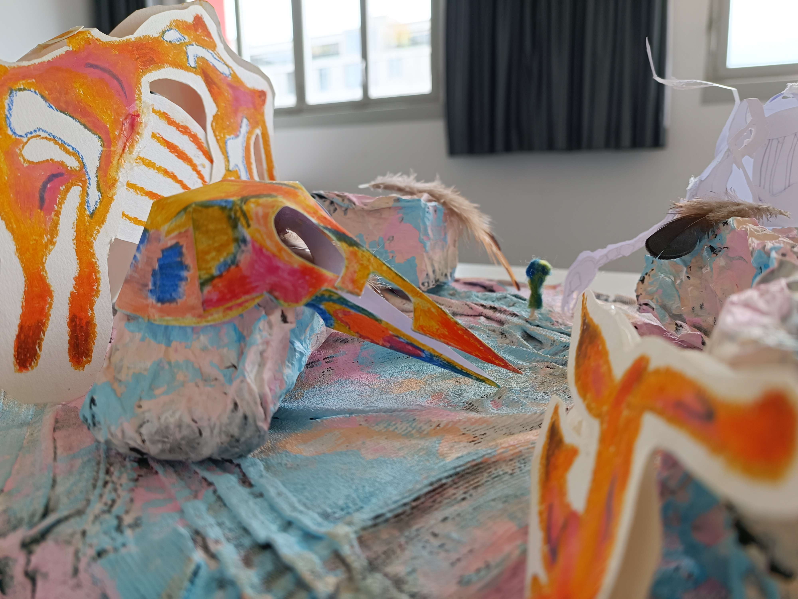
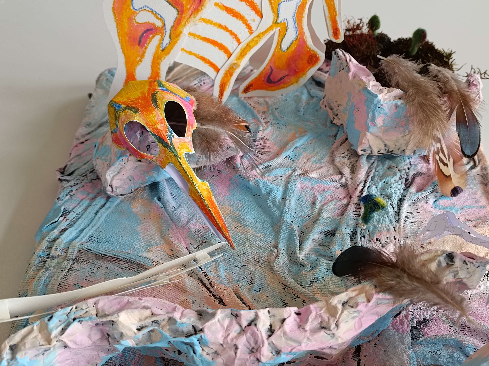
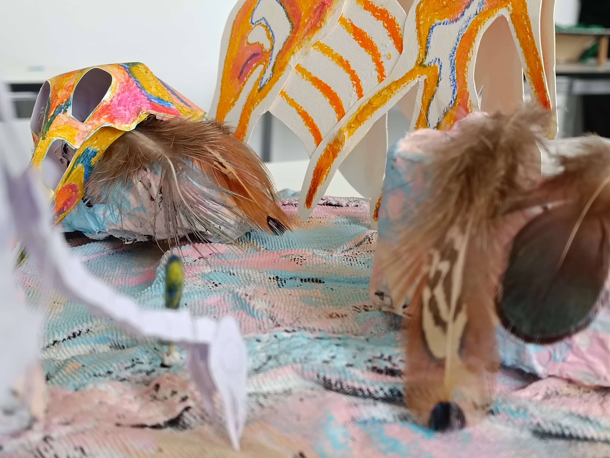
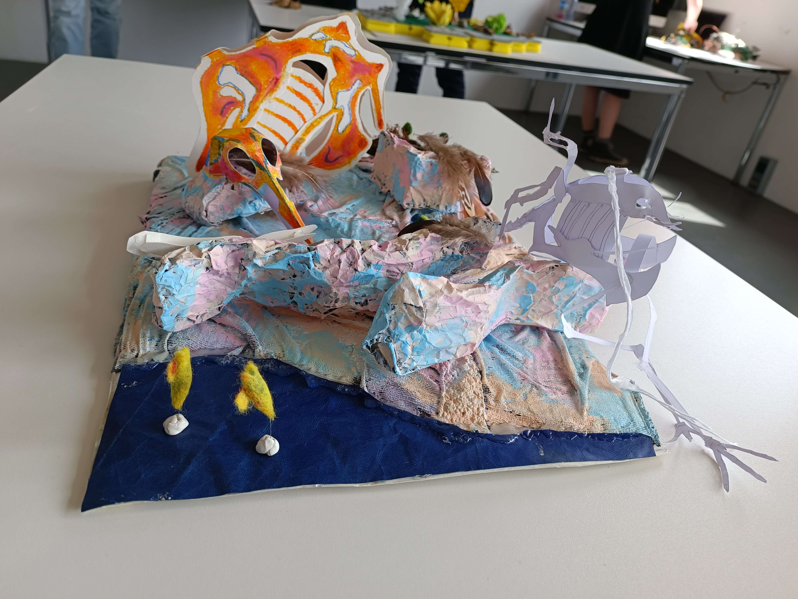
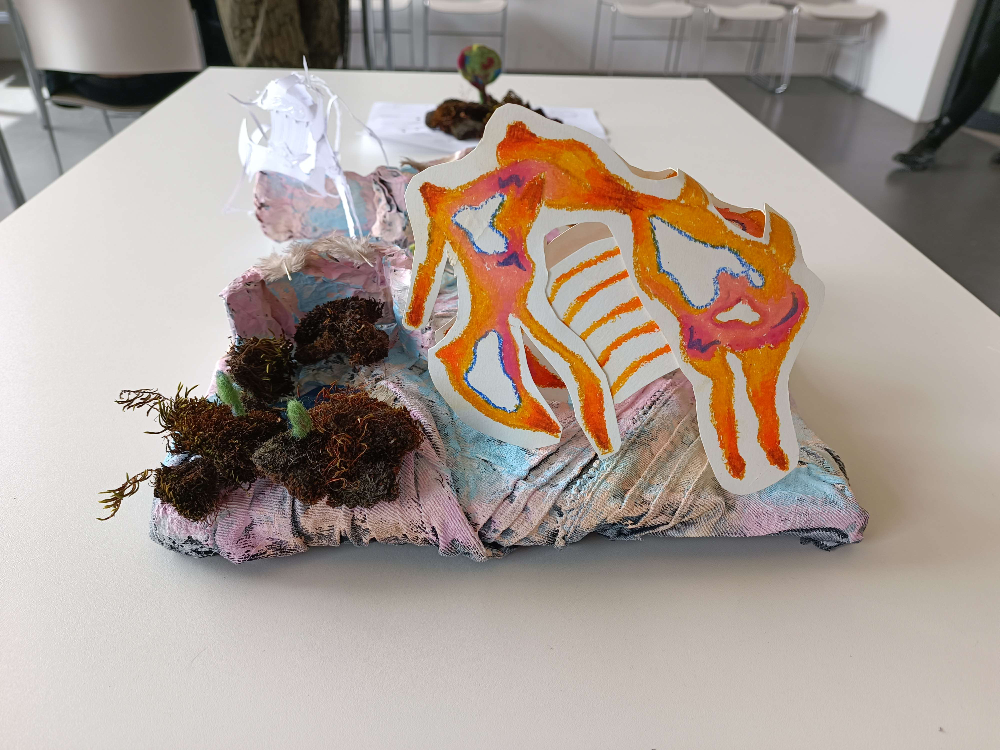
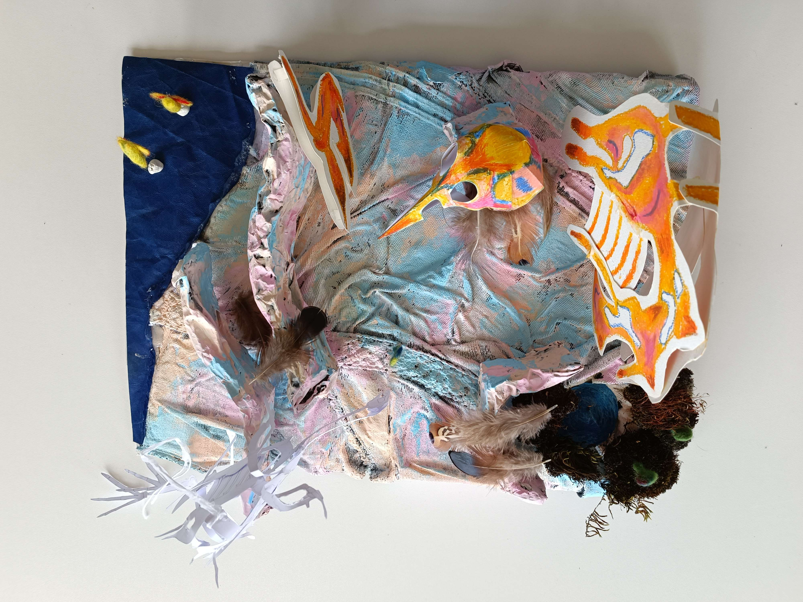
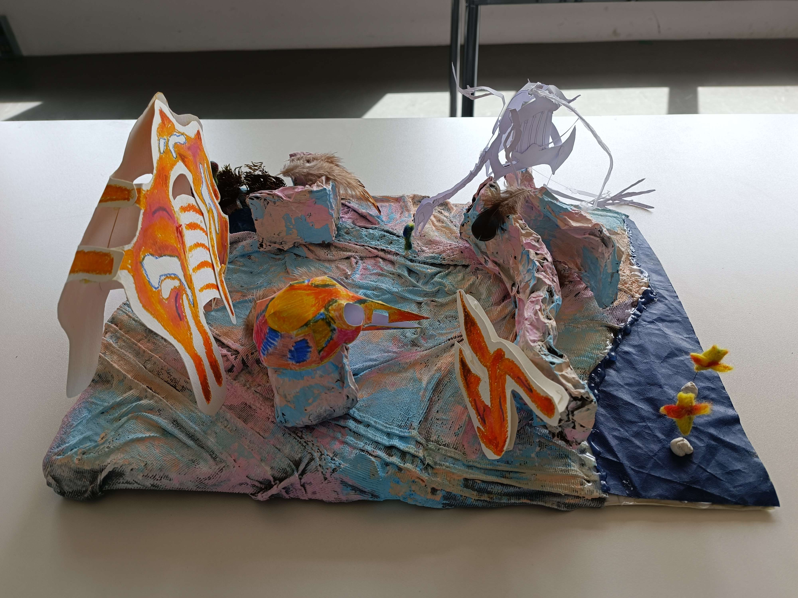
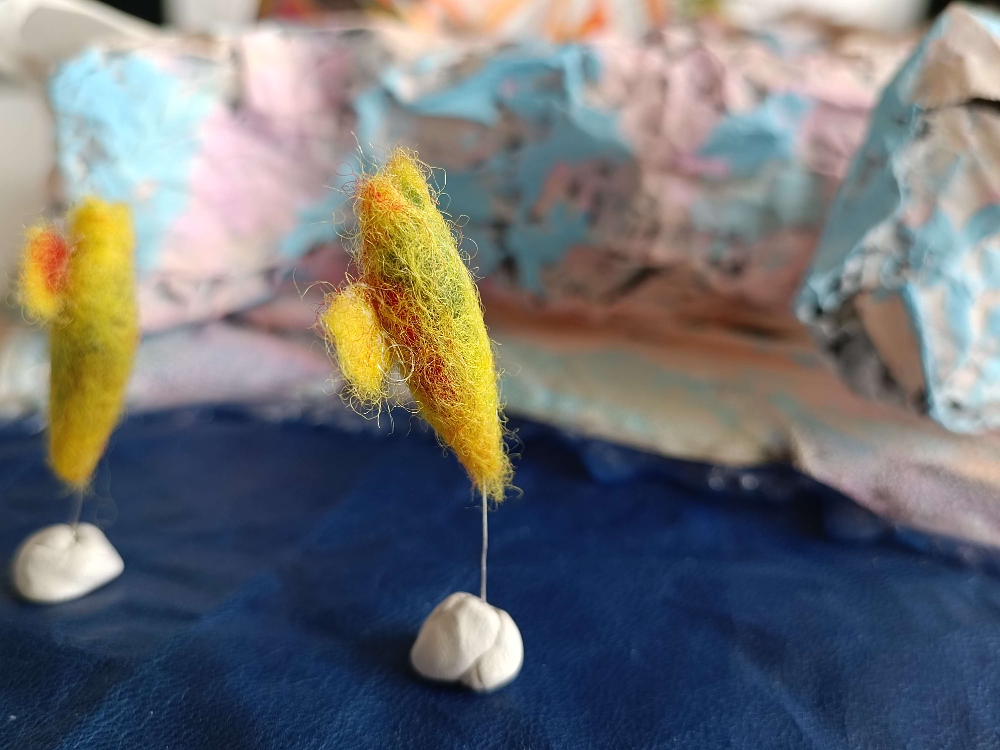
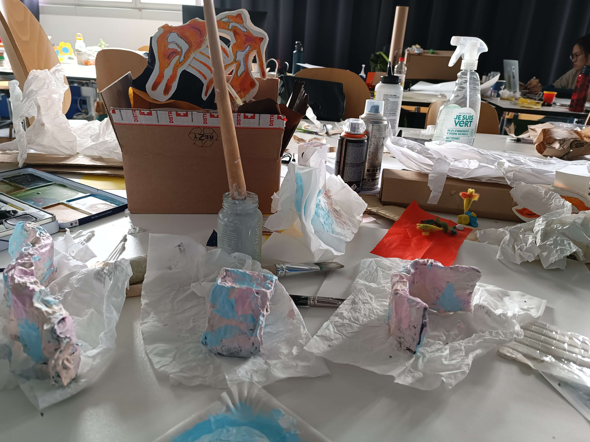
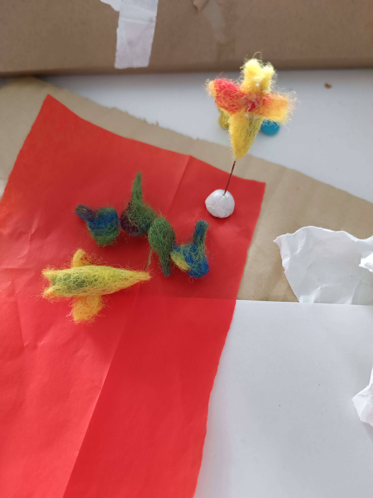

# Seventh day of workshop

## Craft

- We finished building and painting the cliffs/walls
- We made smaller versions of the algae with felted wool
- We scanned our maquette's base and the small verion of the clione

## Presentation with the class

- A lot of things to explain and sometimes it was hard to be understood by the others
- Alexia thought there were a lot of elements

## Brief with the teachers

- We talked with Sabrina about the heart of our project, it helped us a lot (group dynamic, protect the group to ensure the life's transmission)

