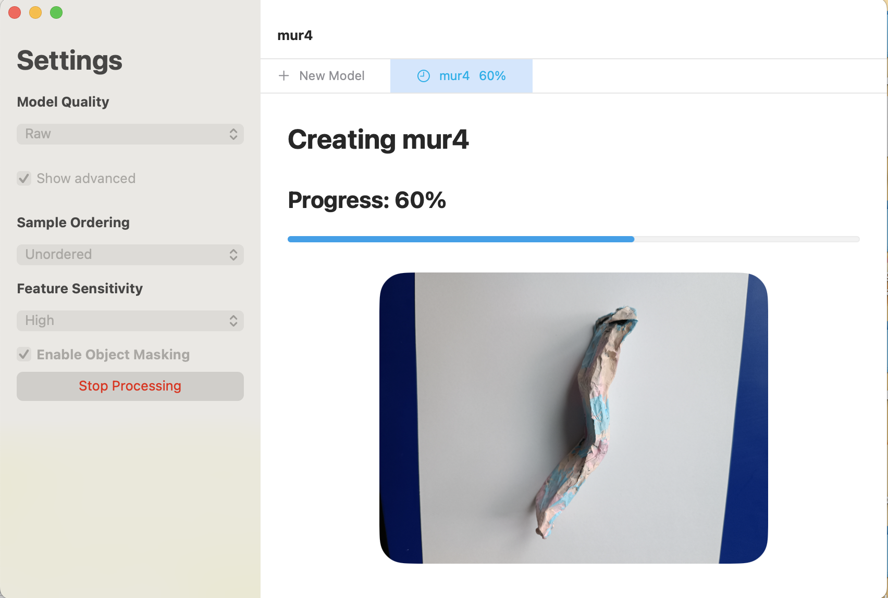
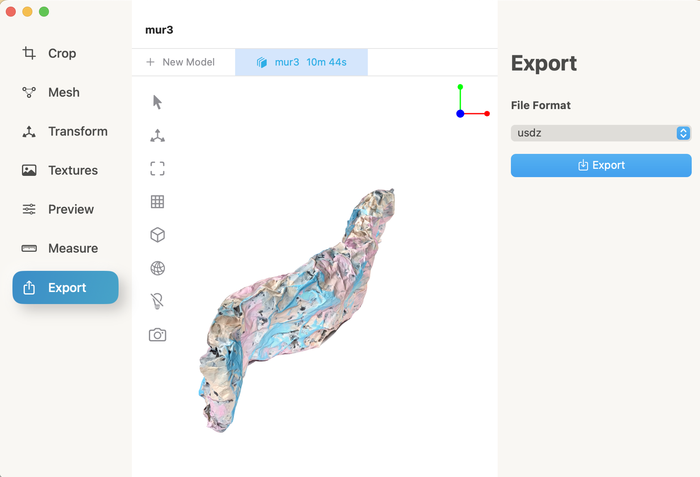
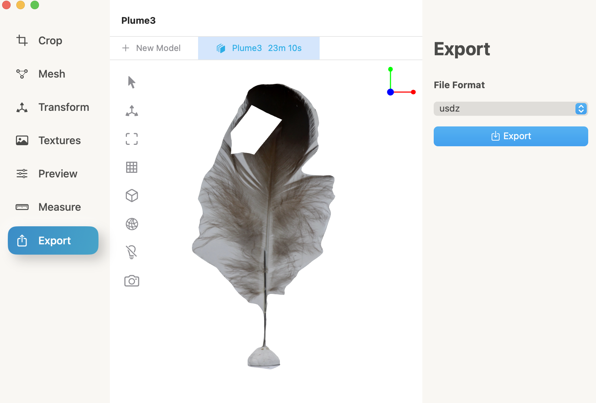
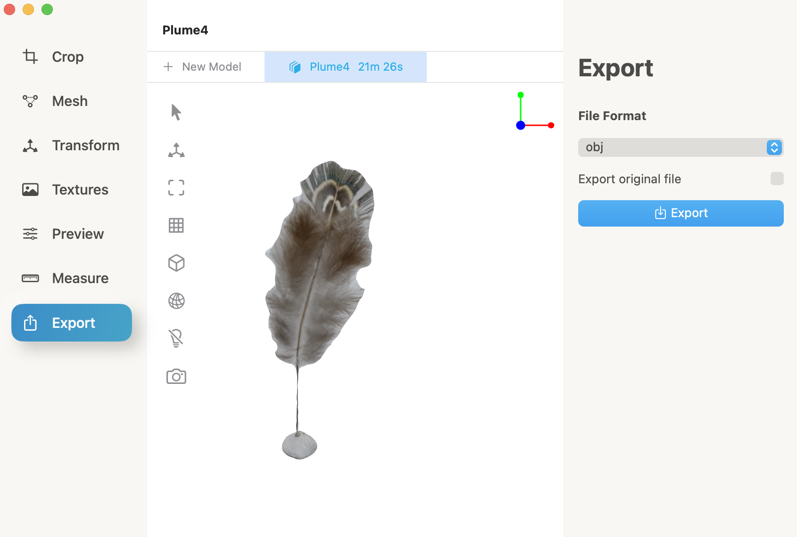

# Eighth day of workshop

## Craft
- We took pictures of our feathers and buildings
- We imported them on PhotoCatch
- Then we exported them in obj
- We learned how to clean our objects on C4D (with Douglas)
- We made a clione's egg in felted wool

