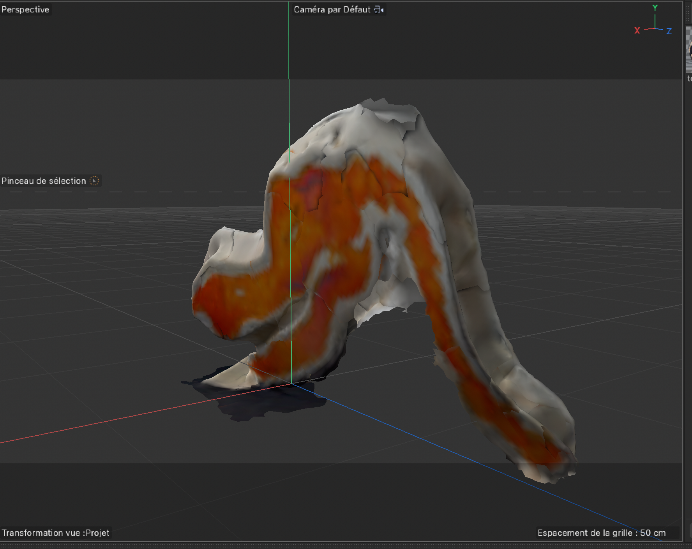
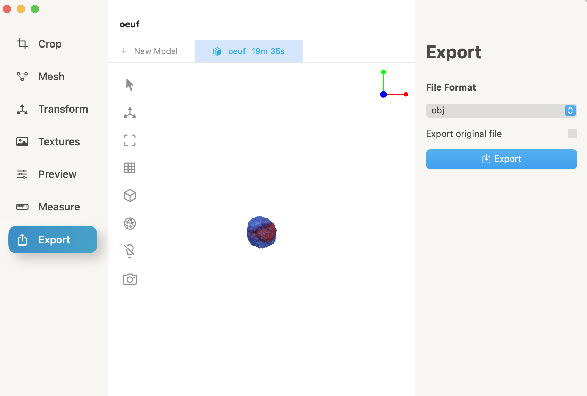
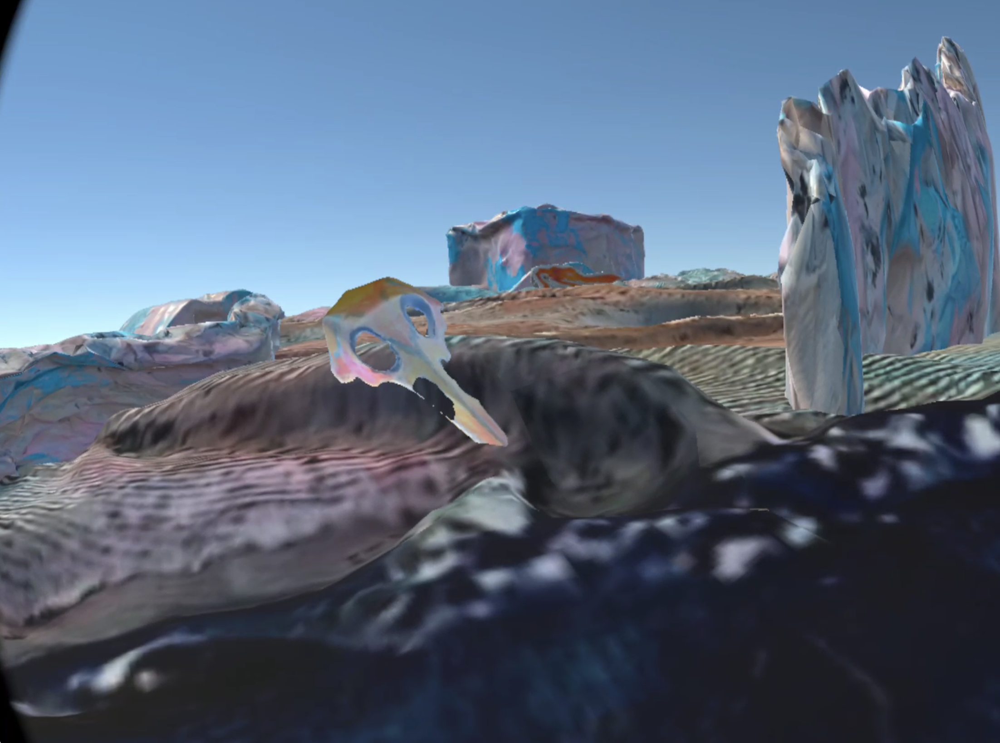
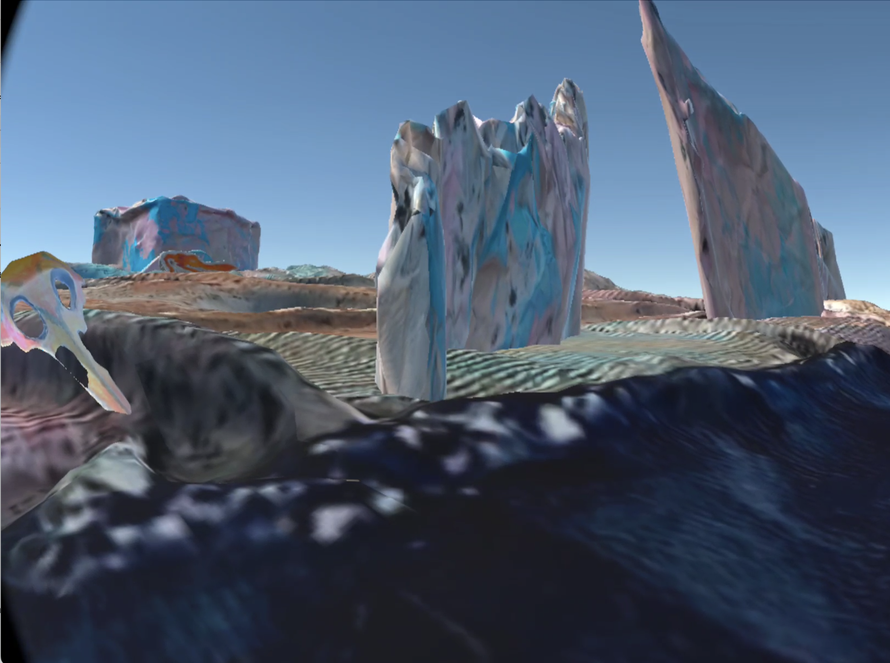
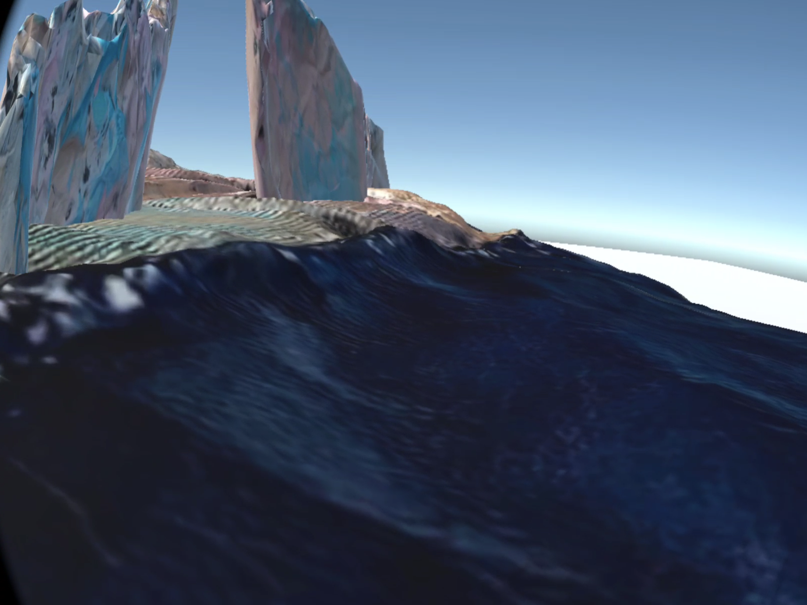
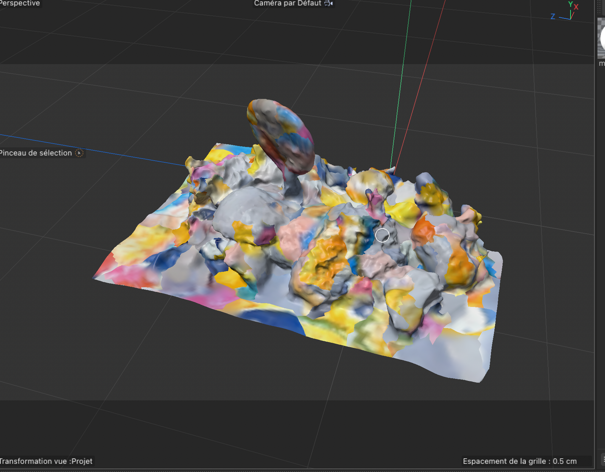

# Ninth day of the workshop

## Craft
- We took pictures of our last asset and put them on PhotoCatch 

## Unity, C4D and Oculus
- We cleaned some of our assets on C4D (walls, 2 heads of birds, and moss)
- We started to create our environment on Unity
- We saw our maquette few times on Oculus and start to have an idea of the position of our camera on unity (Idea about the size view of our cliones)
- We have a better idea of the scale of our assets
- We know how to repare our material on C4D when it's broken (somehow)

## Discussion with teachers
- We learned how to add our textures on unity when they are missing even if we had them on C4D

