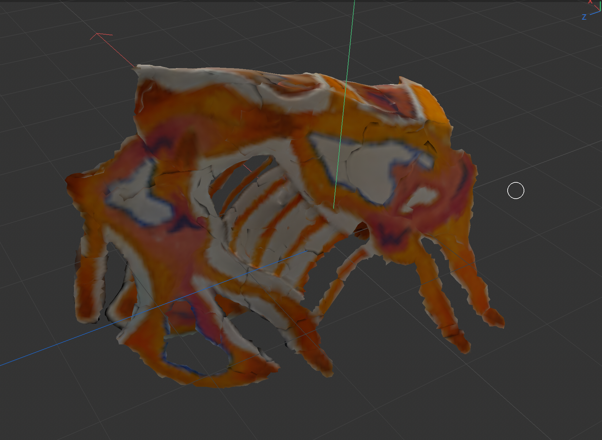
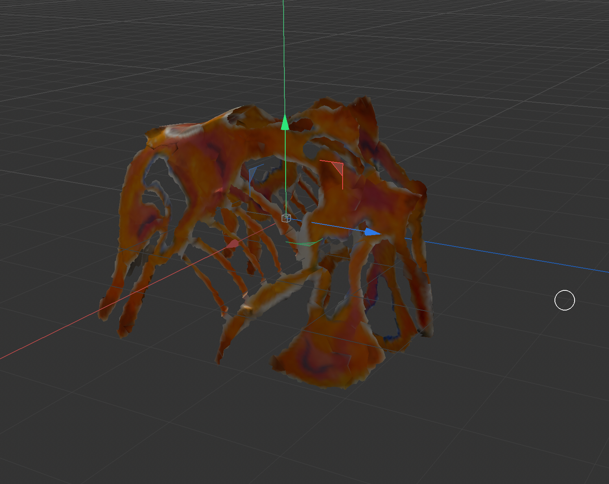
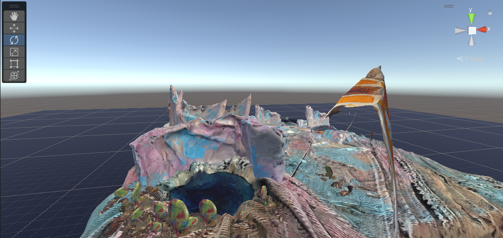
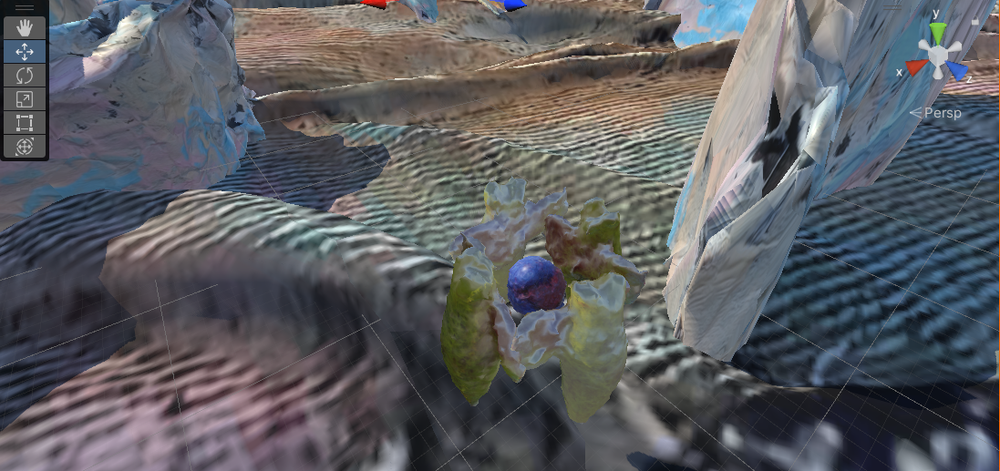
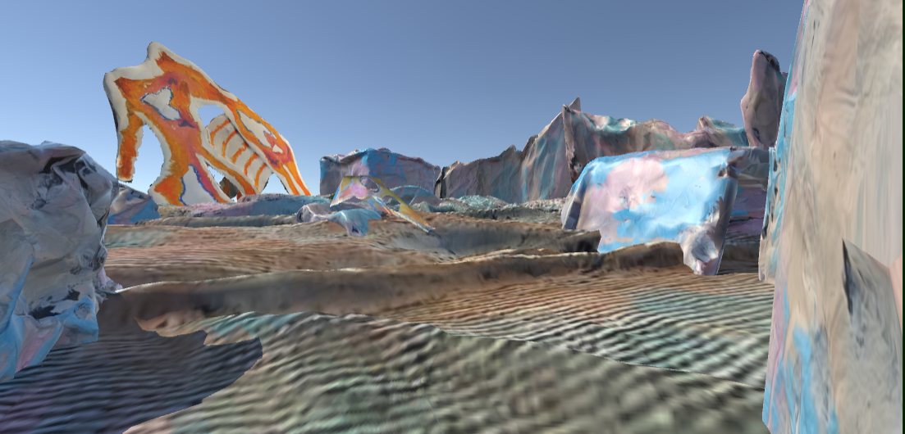
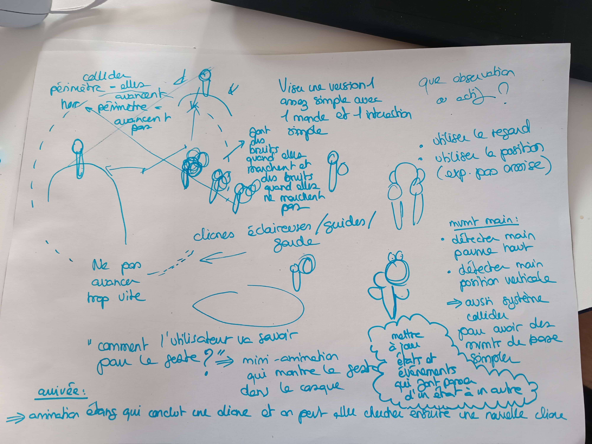
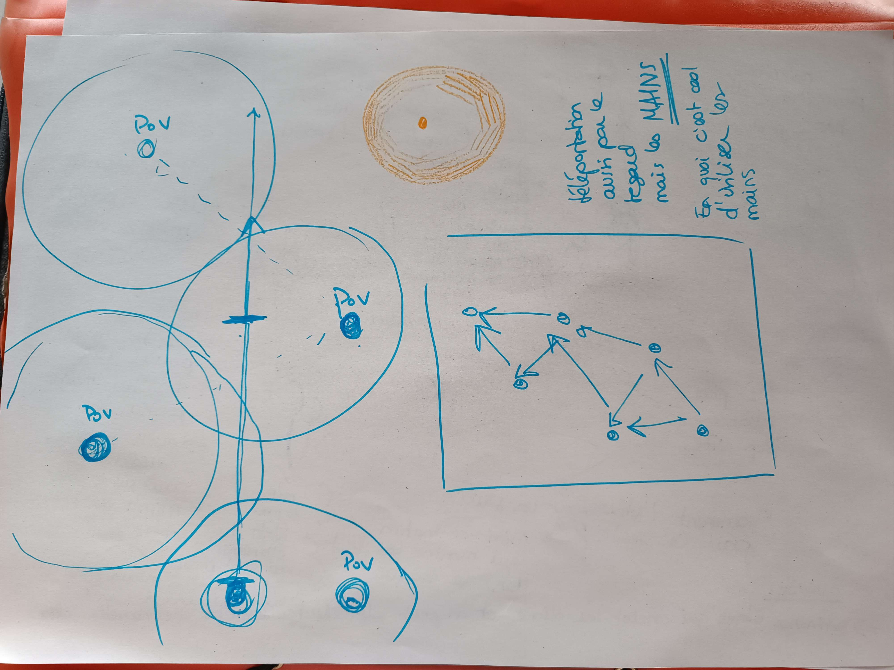

# Twelfth day of the workshop

## Unity, C4D and Oculus

- Solved textures problems in C4D
- Cleaned meshes and prepared them for Unity (exported as FBX format)
- Made two versions of a paper skeleton's scan: one with the original white border and one without
- Importation of FBX files in Unity, attempts to build the environment with them
- Tests with the oculus
- Solved camera problems between Unity and Oculus

## Discussion with teachers

- Now, our project involves different static POV (having a moving camera inside the environment might cause sickness)
- The story changed: we're not carrying the egg but we are illuminating the path for the one who does
- The fundamental move (from french sign language) seems to be ok
- We need to think how about to make the story and actions understandable for the public
- We need to have less colors in our esthethic (work from our texture to achieve a 3-4 colors palette)

