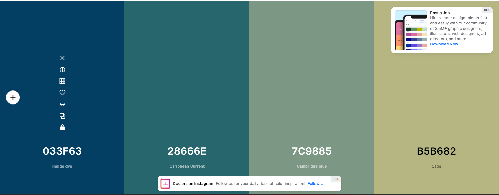
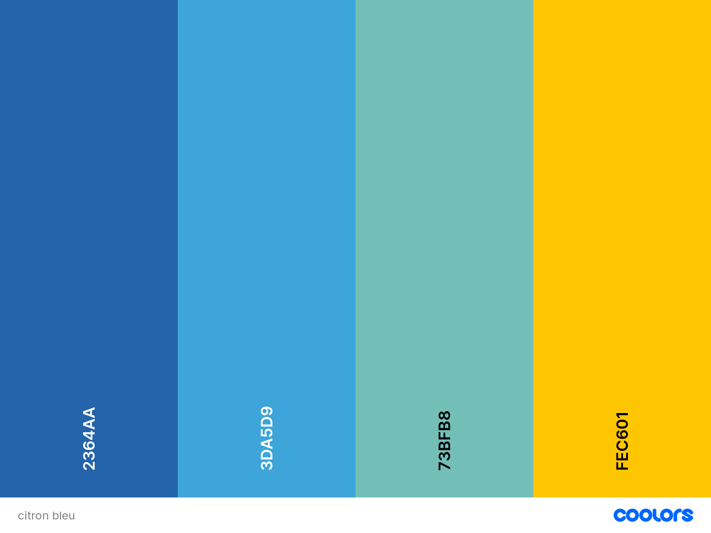
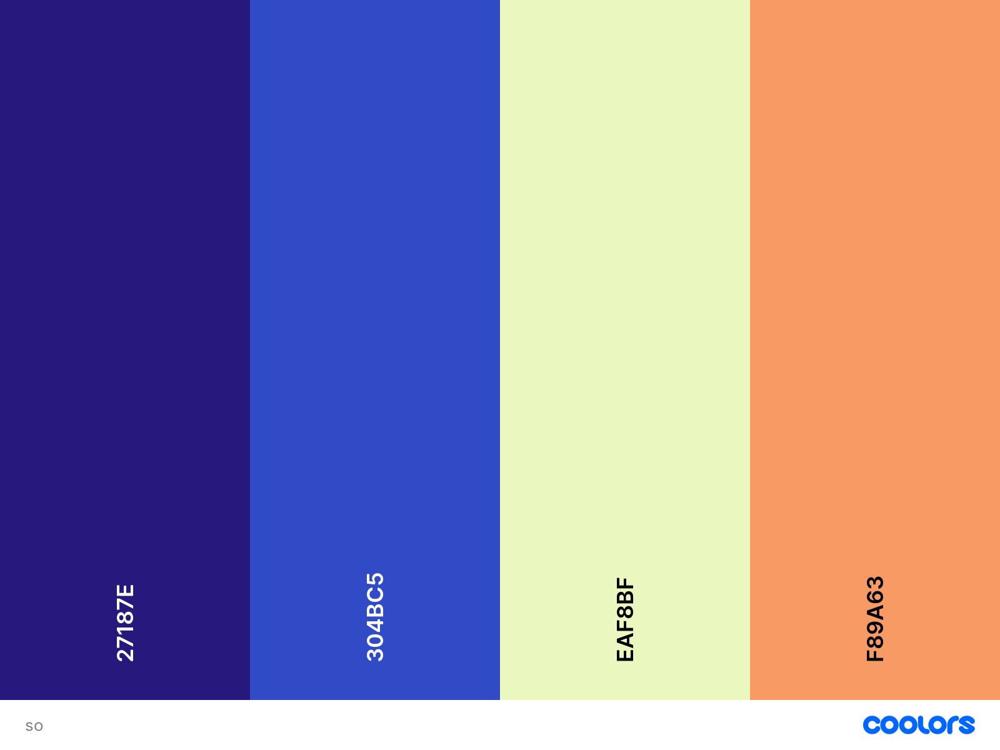

# Thirteenth day of the workshop

## Soundesign

- We spent the whole morning recording sounds for our project

## Unity/Oculus

- We followed the tutorial to add hand interactions

## Craft

- We looked for a new color palette for our environment

## Discussion with teachers

- We're gonna add a little tentacle when we do the hand gesture (it's gonna move like a chaemeleon's tongue)
- Introducing the hand gesture with some pictures at the beginning of the VR but no text is possible

