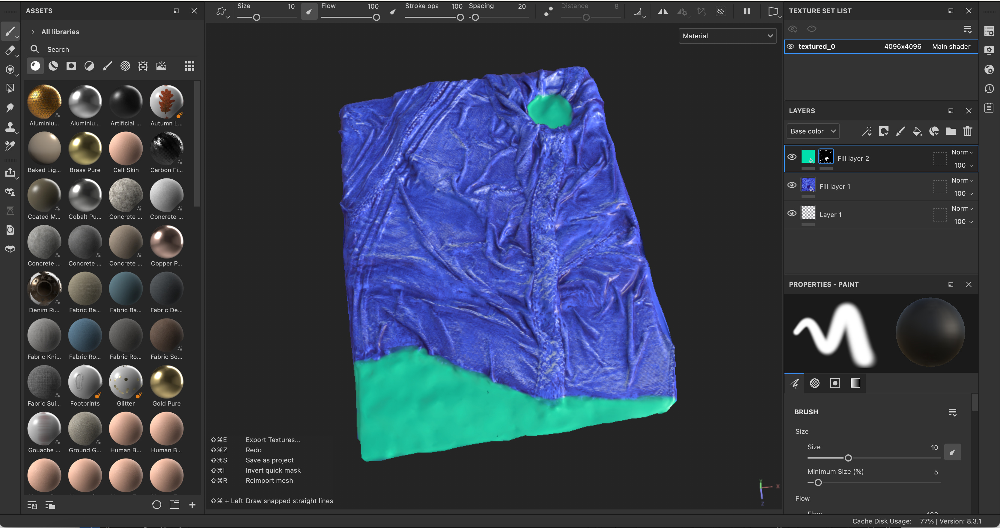
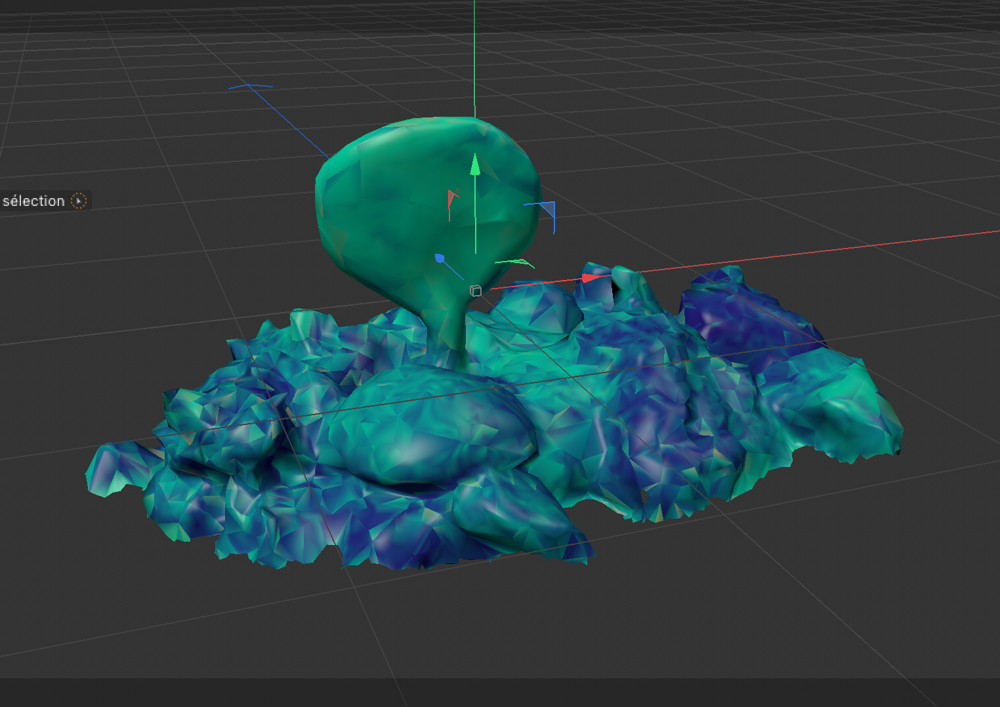
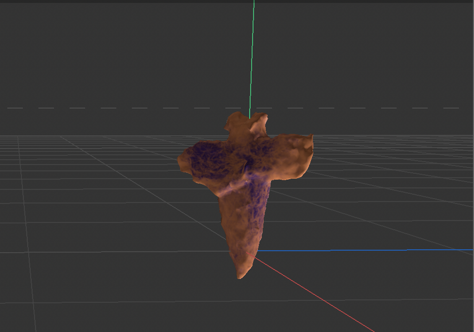
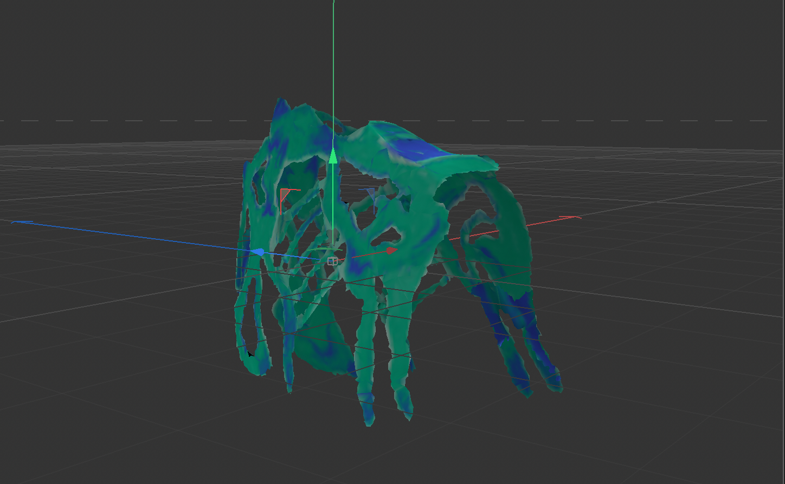
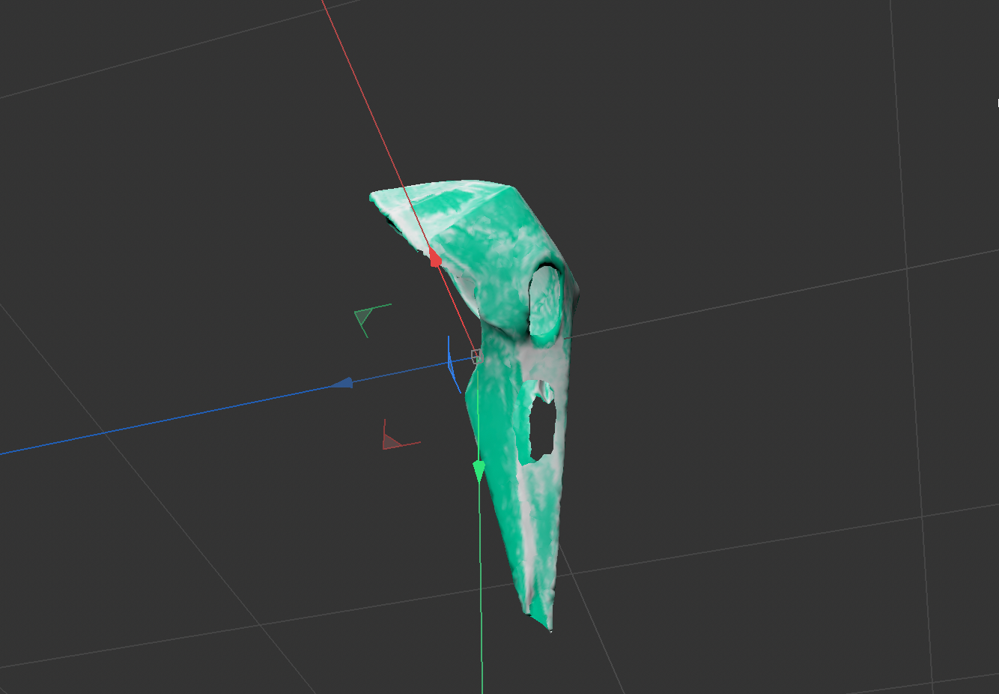
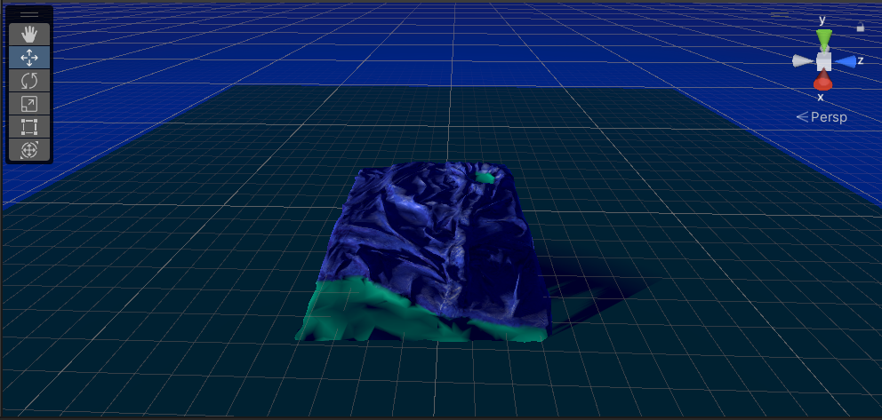
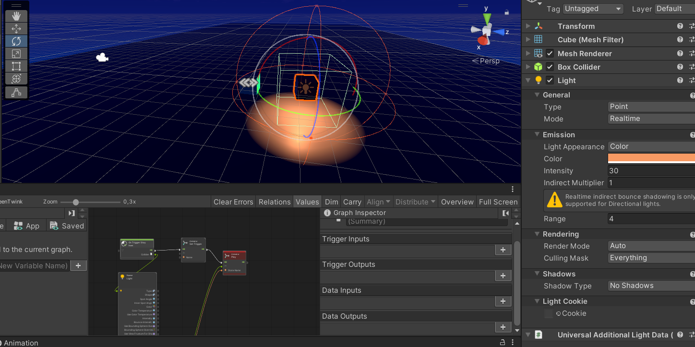

# Forteenth day of the workshop

## C4D/CSP/Sustance

- We started changing our textures' colors

## Unity

- We made a new project (3D URP)
- We started putting the assets into it
- We also tested the new textures
- We started creating a visualscript in order to understand how collisers work and how to trigger animation and light with it

