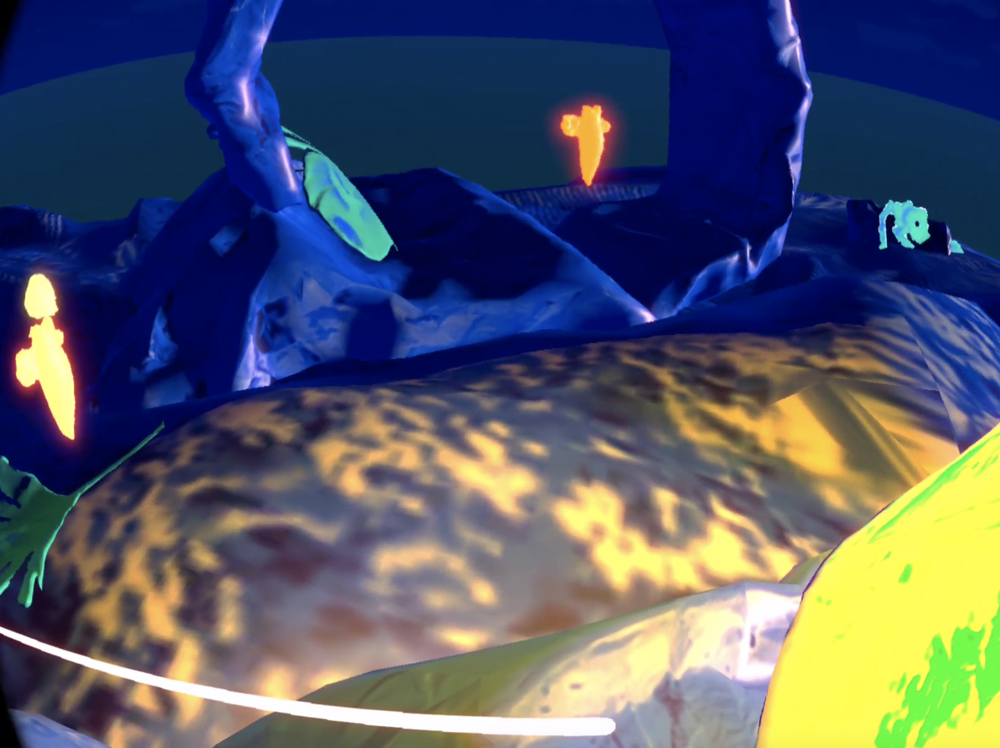

# Day - 3 before the end of the project

## Unity

- Teleportation works (Yahouuu)
- Started creating visual script for sounds (but it's not looping)
- We added a spotlight that moves with XR Origin
- Adjusting the state machine for moving the sea angel carrying the egg (Colliders + Animator)
- We optimized the project (FPS fluidity) => Perfect in the oculus but Flore's play mode is (literally) on fire

## Discussions with the teachers

- We talked with them about the colliders (as a camera child, ...)

