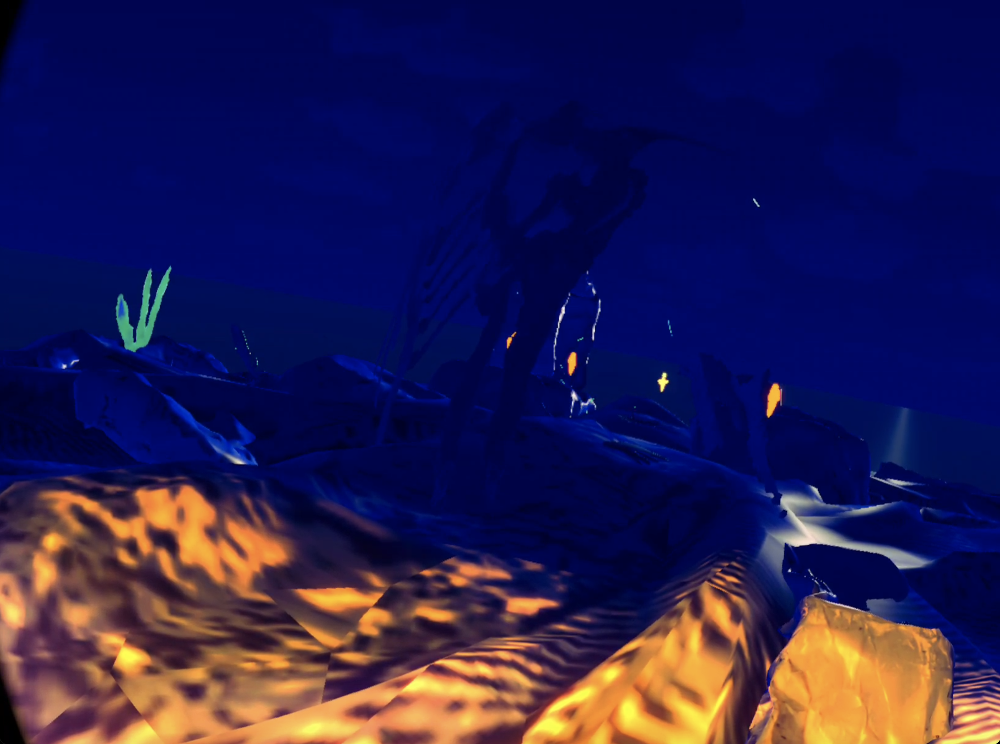

# Day - 2 before the end of the project

## Unity

- The collider interaction is now working
- We added sounds
- We made switching between sounds in the state machine
- We did post prod/calibration (colors, ...)

